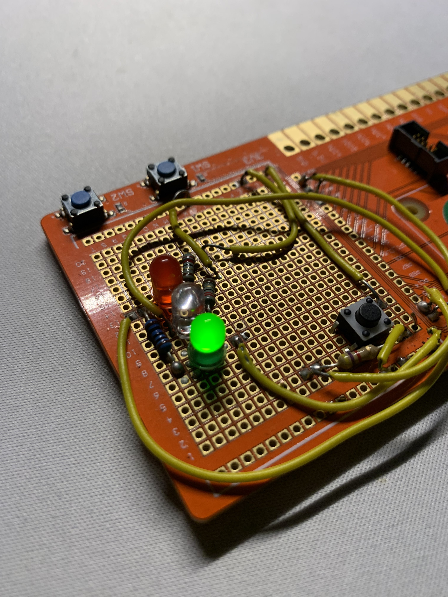

# UWE Digital Design Worksheet 3: Traffic Lights Project
Traffic light code for my physical traffic lights. Digital Design Worksheet 3. These traffic lights are hooked up to a raspberry pi which runs the main.py file and it is connected to a PC via SSH, they work by pressing the physical button on the device after which it will then cycle through the traffic light process just as if it were beside a road. It has the two 'main states' of green or red, and then has the amber light come on as a warning before the light swaps over to red or green. The lights will then always loop back around to its starting point at green. The timings of this can be edited easily through the code, and if there was a real reason to do so then I would have added a feature to the software which allows you to change the timings upon start-up of the program.

I also added a file called toggle.py, this is because i felt like everything functioning on a timing was not always applicable to a traffic light. My toggle.py file allows the traffic light to be controlled entirely from the button, and will only toggle states between green to red or vice versa whenever the button is pressed. I made this a seperate file because I was considering doing functionality to the main script but I figured that it is best to showcase both.

My traffic lights were originally drafted up using the circuit diagram, as shown below, and a breadboard. I transferred this to the main board when everything was functional on the draft and soldered everything together ready for use with the raspberry pi. I encountered only two issues during this process, the first issue I found was that I had accidentally soldered in the green LED the wrong way around. I fixed this issue by reheating the solder using the soldering iron and using a desoldering pump on the heated solder, I then realigned the green traffic light to the correct direction and everything worked as intended past this point. The second issue I encountered was that originally I was using ADC7 to be connected to the button however the wire got a little bit damaged and snapped off leaving a tiny bit of metal and all of the solder inside the ADC7 port, instead of going through the hassle of removing this I instead just switched everything relating to ADC7 over to the ADC5 port instead. I would not have done this if I needed to use all of my ADC ports but this solution worked just fine for this project.

State diagrams showing how the two script files function  

A full image of the board along with the circuit diagram to explain what is happening  

The lights on the board lit up  

A close up image of the board from the front and the back  

